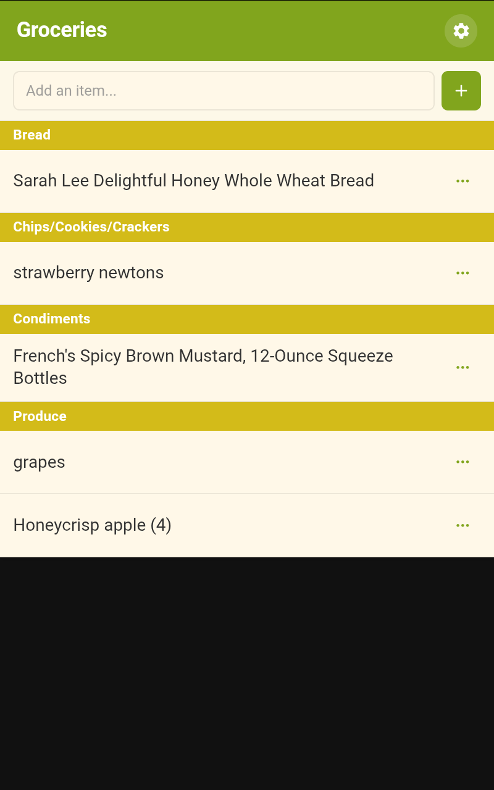

# OurGroceries Kiosk Card

A touch-friendly Home Assistant Lovelace card for managing OurGroceries shopping lists on a wall tablet. One HACS install, enter your credentials, add the card.

<!-- screenshot: card on tablet showing a list with items and categories -->


## Features

- Browse all lists or lock to a single list
- Add, edit, cross off, and remove items
- Category grouping with colored bars and a category picker
- Quantity controls
- 13 built-in themes + system auto (light/dark)
- Autocomplete from your OurGroceries item history
- First-run setup wizard
- In-card settings: any user can change the theme; list mode and locked list are admin-only
- 30-second auto-refresh

## Prerequisites

- [HACS](https://hacs.xyz/) installed
- An [OurGroceries](https://www.ourgroceries.com/) account

## Installation

1. HACS → **Integrations** → **+** → search **OurGroceries Kiosk** → **Install**
2. Restart Home Assistant

**Manual:** Copy `custom_components/ourgroceries_kiosk/` into your `custom_components/` directory and restart.

## Setup

1. **Settings → Devices & Services → Add Integration**
2. Search **OurGroceries Kiosk**
3. Enter your OurGroceries email and password

## Adding the Card

For a full-screen tablet experience, use a **Panel** view. This gives the card the entire viewport with no wasted space.

### Recommended Dashboard YAML

```yaml
kiosk_mode:
  non_admin_settings:
    kiosk: true
  admin_settings:
    kiosk: false
views:
  - type: panel
    cards:
      - type: custom:ourgroceries-kiosk-card
        theme: citrus
        list_mode: single
        locked_list: "Groceries"
```

`type: panel` makes the card fill the screen. The `kiosk_mode` block requires the separate [Kiosk Mode](https://github.com/NemesisRE/kiosk-mode) HACS frontend plugin (see below).

<!-- screenshot: full-screen tablet view with kiosk mode enabled -->


### Card Options

| Option | Values | Description |
|---|---|---|
| `theme` | `citrus`, `dark`, `light`, `berries`, `chestnut`, `festival`, `grapevine`, `ice`, `miami`, `old_glory`, `peacock`, `tangerine`, `vino`, `system` | Visual theme |
| `list_mode` | `all`, `single` | Show all lists or lock to one |
| `locked_list` | list name | Required when `list_mode: single` |
| `default_list` | list name | Optional — auto-opens this list in `all` mode |

## Settings

Tap the **gear icon** in the card header. All users can change the theme. List mode, locked list, and default list are only visible to HA admin users.

## Kiosk Mode

For a clean full-screen experience on a wall tablet, install [Kiosk Mode](https://github.com/NemesisRE/kiosk-mode) from HACS (it's a separate frontend plugin, not part of this integration).

```yaml
kiosk_mode:
  non_admin_settings:
    kiosk: true
  admin_settings:
    kiosk: false
```

**How it works:** Create a dedicated non-admin HA user for the tablet. Non-admin users get a clean full-screen view with no HA sidebar or header. Admin users keep the full HA chrome for editing.

**Escape hatch:** Append `?disable_km` to the URL to temporarily disable kiosk mode.

## Troubleshooting

- **"No lists found"** — Check your credentials in Settings → Devices & Services → OurGroceries Kiosk.
- **Changes slow to appear** — The card polls every 30 seconds. Changes from the OurGroceries app appear on the next poll.
- **Card not in Add Card dialog** — Restart HA after installing. The card JS is auto-registered as a Lovelace resource.

## Out of Scope

- Recipe management
- Creating or deleting lists (use the OurGroceries app)
- Barcode scanning

## License

MIT
